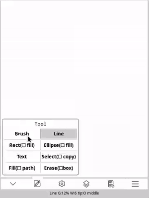
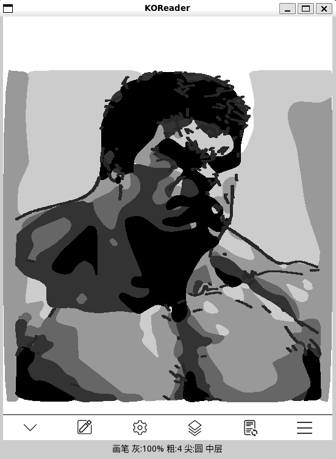
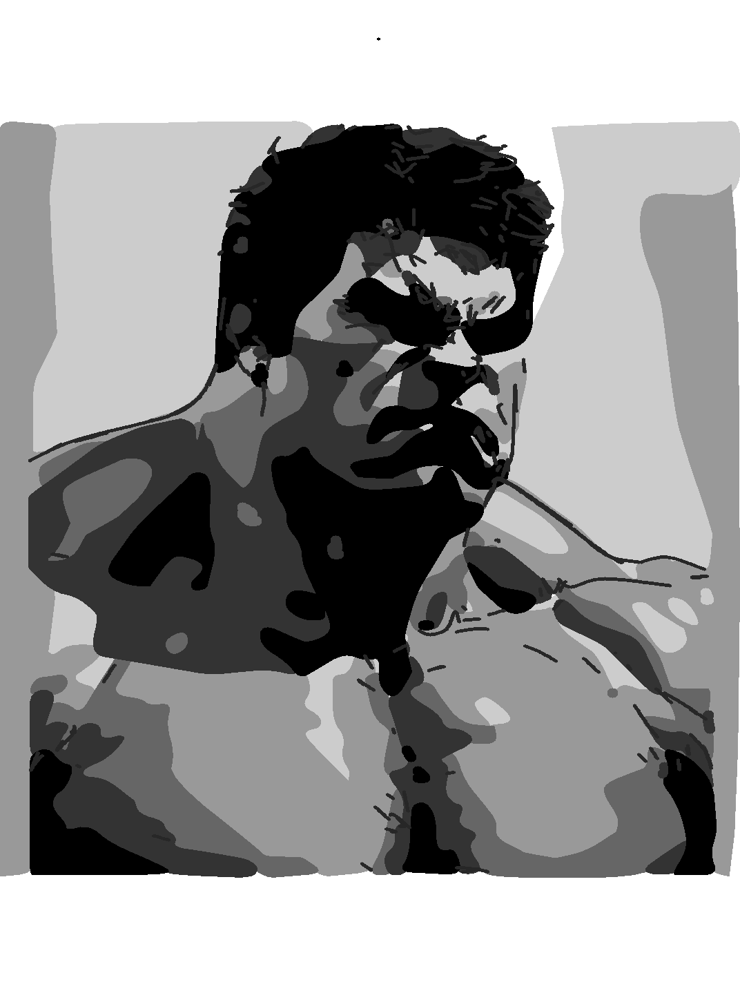

**English** | [简体中文](./README_zh.md)

# Drawingboard for KOReader

A drawing pad for KOReader — sketch and take notes on your e-reader.

Drawingboard adds a fullscreen canvas to KOReader on Kindle and other e-ink devices: 7 brush types (pen / pencil / marker and more), geometric shapes (lines, rectangles, ellipses, solid fills — rotatable), text, object-based erasing, and selection with move / copy / scale / rotate (anchor handles), across 3 layers with visibility toggles and full undo/redo. Artwork can be exported as PNG; projects can be saved and reopened (`.drawing`).

It also doubles as an **e-ink wallpaper generator**: sketch a pattern or illustration, export it as PNG, and set it as your device's sleep screen — no computer needed, fully offline.

The interface is deliberately minimal — a single toolbar over a fullscreen canvas — with the deeper toolkit (layers, transforms, projects, undo history) one tap away. Light to pick up, hard to outgrow.

Refresh behaviour is tuned for e-ink: partial refreshes with region merging and throttling avoid full-screen flashes and ghosting. It also works around real-device quirks such as Kindle startup-script restart loops and framebuffer contention.

The plugin appears as **Drawing Board** (or **绘图板** on Chinese-language systems) in the KOReader menu.

## Screenshots



▸ [Full 2-minute demo (click to play)](https://github.com/eznas/drawingboard.koplugin/blob/main/docs/Demo.mp4)



A grayscale artwork drawn with the drawing board:




## Features

- **Minimal UI, deep toolkit**: fullscreen canvas with a single toolbar; advanced features stay one tap away
- **Brushes**: 7 stroke types, adjustable width, secondary stroke smoothing
- **Shapes**: lines / rectangles / ellipses / solid fills, rotatable (solid shapes recompute their vertices, no self-overlap)
- **Text**: insert anywhere; scales with its object
- **Selection & transforms**: move / copy / scale / rotate selected objects with anchor control
- **Layers**: 3 layers with per-layer visibility and occlusion
- **Undo/redo**, clear canvas, export PNG, save/open `.drawing` projects
- **Wallpaper-ready**: exports are plain PNG — use your own artwork as the device's sleep screen / wallpaper
- **E-ink refresh optimization**: partial refreshes, region merging / limiting / throttling; after a playback finish, control is handed back to the canvas for further editing

## Installation

- **Option 1 (recommended)**: download the latest zip from [Releases](https://github.com/eznas/drawingboard.koplugin/releases), extract it, and copy the whole `drawingboard.koplugin/` folder into your device's KOReader plugins directory (`koreader/plugins/` on Kindle). Restart KOReader and you are done.
- **Option 2**: clone this repository into the same plugins directory (the `drawingpad/test/` folder is only used by headless self-tests and can be deleted):

  ```sh
  git clone https://github.com/eznas/drawingboard.koplugin.git
  ```

## Compatibility

Developed and tested on **Kindle** running recent KOReader releases (2026). The plugin uses only standard KOReader APIs and no device-specific features at runtime, so it should work wherever KOReader runs — but other devices (BOOX, Kobo, PocketBook, desktop) are untested so far. Issue reports from other platforms are welcome.

## Self-tests

`drawingpad/test/` contains headless (wbuilder) self-test scripts that run with plain `lua`, for example:

```sh
lua drawingpad/test/feature_test.lua
```

## Licence

Released under the [AGPL-3.0](LICENSE), the same licence as KOReader.

Acknowledgements:

- [KOReader](https://github.com/koreader/koreader) — the platform this plugin runs on; `drawingpad/icons/appbar.menu.svg` and `drawingpad/icons/cre.render.reload.svg` are taken from the official KOReader icon set (AGPL-3.0). All other icons are original.
